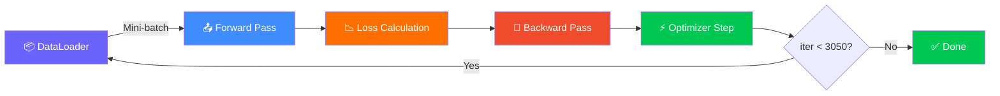

<div align="center">
  
  <!-- ANIMATED HEADER -->
  

  <br><br>

  <!-- BADGES ROW 1 -->
  <a href="#"></a>
  <a href="#"></a>
  <a href="#"></a>
  <a href="#"></a>

  <br>

  <!-- BADGES ROW 2 -->
  
  
  
  
  

  <br><br>

  <!-- SUBTITLE -->
  <h3><i>Building, Training & Evaluating a Neural Network from Scratch using PyTorch</i></h3>
  
  <h4><code>Assignment 02 — Deep Learning Essentials</code></h4>
  <h2><b>University of Pennsylvania</b></h2>

  <br><br>

  <!-- DIVIDER -->
  

</div>

---

<br>

<!-- ======================================================================== -->
<!-- 🚀 OVERVIEW SECTION -->
<!-- ======================================================================== -->

<table align="center" width="100%">
<tr>
<td width="60%" valign="top">

<h2>🚀 Project Overview</h2>

<p>This project implements a complete <strong>Neural Network training pipeline</strong> using <strong>PyTorch</strong> — Meta's industry-leading deep learning framework. We build, train, and evaluate a single-layer neural network on the classic <strong>MNIST handwritten digit dataset</strong>.</p>

<h3>🎯 Key Objectives</h3>
<ul>
  <li>✅ Implement the <strong>Backpropagation algorithm</strong> in PyTorch</li>
  <li>✅ Build a custom <code>Dataset</code> class for MNIST</li>
  <li>✅ Sub-sample & normalize the dataset</li>
  <li>✅ Train using <strong>SGD optimizer</strong> with CrossEntropy loss</li>
  <li>✅ Visualize training & validation loss curves</li>
  <li>✅ Achieve ~91% accuracy on digit classification</li>
</ul>

</td>
<td width="40%" align="center">

<!-- NEURAL NETWORK ASCII / ICON -->
<br>
<div align="center">
  
  
  <br><br>
  <p><b>🧬 Input → Hidden → Output</b></p>
  <code>784 → (ReLU) → 10</code>
</div>

</td>
</tr>
</table>

<br>

<!-- ======================================================================== -->
<!-- 📚 DATASET SECTION -->
<!-- ======================================================================== -->

<h2 align="center">📚 The MNIST Dataset</h2>

<div align="center">
  
</div>

<br>

<table align="center">
<tr>
  <td align="center" width="33%">
    <br>
    <sub><b>Fig 1:</b> Getting the MNIST Dataset</sub>
  </td>
  <td align="center" width="33%">
    <br>
    <sub><b>Fig 2:</b> Subsampling & Normalization</sub>
  </td>
  <td align="center" width="33%">
    <br>
    <sub><b>Fig 3:</b> Custom Dataset Class</sub>
  </td>
</tr>
</table>

<br>

<div align="center">
<table>
<tr>
<td>🎯 <b>Training Samples</b></td>
<td>30,000 (sub-sampled from 60,000)</td>
</tr>
<tr>
<td>🧪 <b>Validation Samples</b></td>
<td>5,000 (sub-sampled from 10,000)</td>
</tr>
<tr>
<td>🔢 <b>Image Size</b></td>
<td><code>28 × 28 = 784 pixels</code> (flattened)</td>
</tr>
<tr>
<td>🏷️ <b>Classes</b></td>
<td>10 (digits <code>0–9</code>)</td>
</tr>
<tr>
<td>📊 <b>Normalization</b></td>
<td><code>X / 255</code> → pixel range [0, 1]</td>
</tr>
</table>
</div>

<br>

<!-- ======================================================================== -->
<!-- 🏗️ ARCHITECTURE SECTION -->
<!-- ======================================================================== -->

<h2 align="center">🏗️ Neural Network Architecture</h2>

<div align="center">
  
</div>

<br>

<table align="center" width="100%">
<tr>
<td width="45%" align="center">

```python
class Net(nn.Module): 
    def __init__(self):
        super(Net, self).__init__()
        self.fc1 = nn.Linear(784, 10)

    def forward(self, x):
        out = F.relu(self.fc1(x))
        return out
```

</td>
<td width="55%" valign="center">

<pre align="left">
┌──────────────────────────────────────────┐
│          Input Layer (784)                │
│       ───  28×28 flattened  ───          │
├──────────────────────────────────────────┤
│              ▼                            │
│     Fully Connected (Linear)             │
│         nn.Linear(784, 10)               │
├──────────────────────────────────────────┤
│              ▼                            │
│     Activation: ReLU                     │
│         F.relu()                         │
├──────────────────────────────────────────┤
│              ▼                            │
│        Output Layer (10)                 │
│    ───  digit classes 0–9  ───          │
└──────────────────────────────────────────┘
</pre>

</td>
</tr>
</table>

<div align="center">
<table>
<tr>
<td>🔗 <b>Layer Type</b></td>
<td><code>nn.Linear</code> (Fully Connected)</td>
</tr>
<tr>
<td>⚡ <b>Activation</b></td>
<td><code>F.relu</code> (Rectified Linear Unit)</td>
</tr>
<tr>
<td>📏 <b>Parameters</b></td>
<td><code>784 × 10 + 10 = 7,850</code> trainable params</td>
</tr>
</table>
</div>

<br>

<!-- ======================================================================== -->
<!-- 🏋️ TRAINING PIPELINE -->
<!-- ======================================================================== -->

<h2 align="center">🏋️ Training Pipeline</h2>

<div align="center">
  
</div>

<br>

<!-- Training Loop Visual -->
<div align="center">
  


</div>

<br>

<table align="center" width="100%">
<tr>
<td align="center" width="33%">
  <div>
    <h3>📥 <b>Step 1</b></h3>
    <p><b>Forward Pass</b></p>
    <code>outputs = net(x)</code>
    <p><sub>Apply network to input data</sub></p>
  </div>
</td>
<td align="center" width="33%">
  <div>
    <h3>📉 <b>Step 2</b></h3>
    <p><b>Loss Calculation</b></p>
    <code>loss = criterion(outputs, y)</code>
    <p><sub>CrossEntropyLoss</sub></p>
  </div>
</td>
<td align="center" width="33%">
  <div>
    <h3>🔄 <b>Step 3</b></h3>
    <p><b>Backpropagation</b></p>
    <code>loss.backward()</code>
    <p><sub>Compute gradients</sub></p>
  </div>
</td>
</tr>
<tr>
<td align="center" colspan="3">
  <br>
  <h3>⚡ <b>Step 4: Optimizer Update</b></h3>
  <table>
    <tr>
      <td><code>optimizer.zero_grad()</code></td>
      <td>↔</td>
      <td><code>optimizer.step()</code></td>
    </tr>
    <tr>
      <td><sub>Zero the gradients</sub></td>
      <td></td>
      <td><sub>Update weights</sub></td>
    </tr>
  </table>
</td>
</tr>
</table>

<br>

<!-- ======================================================================== -->
<!-- 📸 IMPLEMENTATION SCREENSHOTS -->
<!-- ======================================================================== -->

<h2 align="center">📸 Implementation Evidence</h2>

<div align="center">
  
</div>

<br>

<div align="center">
<table width="100%">
<tr>
  <td align="center" width="50%">
    <br>
    <sub><b>Fig 4:</b> Training Loop Execution — Forward pass, loss & error logging per iteration</sub>
  </td>
  <td align="center" width="50%">
    <br>
    <sub><b>Fig 5:</b> Validation Function — Computing validation loss & error</sub>
  </td>
</tr>
<tr>
  <td align="center" width="50%" colspan="2">
    <br>
    <br>
    <sub><b>Fig 6:</b> All Tests Passed — Subsampling, Dataset, Forward Pass, Training & Validation</sub>
  </td>
</tr>
</table>
</div>

<br>

<!-- ======================================================================== -->
<!-- 📊 RESULTS -->
<!-- ======================================================================== -->

<h2 align="center">📊 Results & Visualizations</h2>

<div align="center">
  
</div>

<br>

<div align="center">
<table>
<tr>
  <th>Metric</th>
  <th>Training</th>
  <th>Validation</th>
</tr>
<tr>
  <td><b>Loss Trend</b></td>
  <td>📉 <span style="color:#00C853">Decreasing</span></td>
  <td>📉 <span style="color:#00C853">Decreasing</span></td>
</tr>
<tr>
  <td><b>Error Rate</b></td>
  <td><span style="color:#00C853">~9%</span></td>
  <td><span style="color:#00C853">~9%</span></td>
</tr>
<tr>
  <td><b>Accuracy</b></td>
  <td>~91%</td>
  <td>~91%</td>
</tr>
</table>
</div>

<br>

<div align="center">
  <blockquote>
    <p><b>💡 Key Insight:</b> Both training and validation losses decrease with iterations, confirming that <b>the model is learning</b> effectively via backpropagation. Validation is performed every <b>1000 iterations</b>, showing consistent improvement.</p>
  </blockquote>
</div>

<br>

<!-- ======================================================================== -->
<!-- 🛠️ TECH STACK -->
<!-- ======================================================================== -->

<h2 align="center">🛠️ Technologies Used</h2>

<div align="center">
  
</div>

<br>

<div align="center">
  
| | | |
|:---:|:---:|:---:|
|  |  |  |
|  |  |  |

</div>

<br>

<!-- ======================================================================== -->
<!-- 📋 TABLE OF CONTENTS -->
<!-- ======================================================================== -->

<h2 align="center">📋 Quick Links</h2>

<div align="center">
  
</div>

<br>

<div align="center">
  
| Section | Description |
|:---|:---|
| 📚 **[Assignment Notebook](./dl_assignment_2.ipynb)** | Full implementation with code, tests & visualization |
| 🧬 **[Data Preprocessing](#the-mnist-dataset)** | Subsampling, normalization & Dataset class |
| 🏗️ **[Model Architecture](#neural-network-architecture)** | Single-layer NN with ReLU activation |
| 🏋️ **[Training Pipeline](#training-pipeline)** | Forward pass, backpropagation & SGD optimizer |
| 📊 **[Results](#results--visualizations)** | Loss curves & accuracy metrics |

</div>

<br>

<!-- ======================================================================== -->
<!-- 🎓 FINAL TAKEAWAYS -->
<!-- ======================================================================== -->

<h2 align="center">🎓 Final Takeaways</h2>

<div align="center">
  
</div>

<br>

<div align="center">
<table>
<tr>
<td>✅</td>
<td><b>Backpropagation</b> — successfully implemented gradient computation & weight updates</td>
</tr>
<tr>
<td>✅</td>
<td><b>PyTorch Workflow</b> — mastered Dataset, DataLoader, optim, nn.Module pipeline</td>
</tr>
<tr>
<td>✅</td>
<td><b>Loss Convergence</b> — both training & validation loss decrease over time</td>
</tr>
<tr>
<td>✅</td>
<td><b>Generalization</b> — model performs consistently on unseen validation data (~91%)</td>
</tr>
</table>
</div>

<br>

<!-- ======================================================================== -->
<!-- 🙌 ACKNOWLEDGMENTS -->
<!-- ======================================================================== -->

<div align="center">

<h4><i>🧠 "Backpropagation was first postulated roughly 40 years ago by Geoffrey Hinton — one of the authority figures in Deep Learning today. He was awarded the Turing Prize for his contributions."</i></h4>

<br><br>


</div>